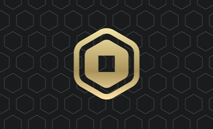
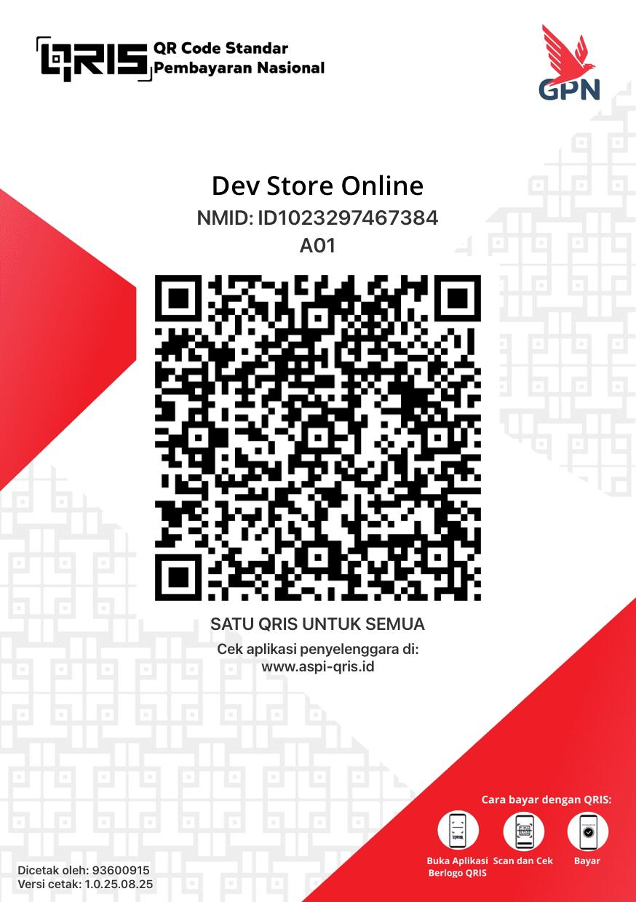
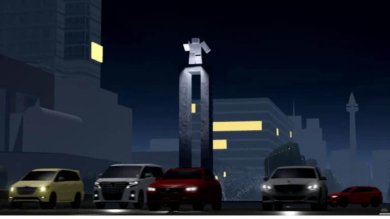

# 📸 DAFTAR FILE GAMBAR - DEV ROBLOX SHOP

Dokumentasi lengkap untuk semua file gambar yang digunakan di website dan admin panel Dev Roblox Shop.

---

## 📁 STRUKTUR FOLDER GAMBAR

```
assets/images/
├── logo.jpg                    ← Logo utama website
├── qris.png                    ← QR Code pembayaran QRIS
├── robux-gamepass.png          ← Cover produk Robux Via Gamepass
├── premium.png                 ← Cover produk Upgrade Premium
├── robux-instant.png           ← Cover produk Robux Instant
├── akun-roblox.png             ← Cover produk Akun Roblox
├── car-driving.png             ← Game card Car Driving Indonesia
├── taxi-boss.png               ← Game card Taxi Boss
├── steal-brainrot.png          ← Game card Steal a Brainrot
├── strongest-battlegrounds.png ← Game card Strongest Battlegrounds
├── brookhaven.png              ← Game card Brookhaven RP
├── salon-fiestas.png           ← Game card Salon de Fiestas
├── blox-fruit.png              ← Game card Blox Fruit
├── fisch.png                   ← Game card Fisch
└── grow-garden.png             ← Game card Grow Garden
```

---

## 🖼️ DETAIL SETIAP GAMBAR

### 1. **logo.jpg**
- **Lokasi**: `/assets/images/logo.jpg`
- **Ukuran Rekomendasi**: 200x200 px (square)
- **Digunakan di**:
  - Header website (50x50 px)
  - Admin panel header (30x30 px)
  - Footer website
  - Loading screen
- **Tipe File**: JPEG atau PNG
- **Deskripsi**: Logo perusahaan DEV ROBLOX SHOP dengan warna gradien biru

---

### 2. **qris.png**
- **Lokasi**: `/assets/images/qris.png`
- **Ukuran Rekomendasi**: 300x300 px
- **Digunakan di**:
  - Modal checkout/pembayaran
  - Halaman produk saat user memilih metode pembayaran QRIS
- **Tipe File**: PNG (transparansi)
- **Deskripsi**: QR Code statis untuk pembayaran QRIS ke rekening toko

---

### 3. **robux-gamepass.png**
- **Lokasi**: `/assets/images/robux-gamepass.png`
- **Ukuran Rekomendasi**: 400x300 px (landscape)
- **Digunakan di**:
  - Halaman product grid (280x200 px)
  - Halaman produk Robux Via Gamepass hero image
- **Tipe File**: PNG atau JPEG
- **Deskripsi**: Gambar illustrasi produk Robux dengan elemen Gamepass, warna dominan biru & kuning

---

### 4. **premium.png**
- **Lokasi**: `/assets/images/premium.png`
- **Ukuran Rekomendasi**: 400x300 px
- **Digunakan di**:
  - Halaman product grid
  - Halaman produk Upgrade Premium
- **Tipe File**: PNG atau JPEG
- **Deskripsi**: Gambar badge "PREMIUM" dengan efek gold/emas, background gradient biru

---

### 5. **robux-instant.png**
- **Lokasi**: `/assets/images/robux-instant.png`
- **Ukuran Rekomendasi**: 400x300 px
- **Digunakan di**:
  - Halaman product grid
  - Halaman produk Robux Instant
- **Tipe File**: PNG atau JPEG
- **Deskripsi**: Icon Robux dengan efek bersinar, background gradient biru cerah

---

### 6. **akun-roblox.png**
- **Lokasi**: `/assets/images/akun-roblox.png`
- **Ukuran Rekomendasi**: 400x300 px
- **Digunakan di**:
  - Halaman product grid
  - Halaman produk Akun Roblox
- **Tipe File**: PNG atau JPEG
- **Deskripsi**: Karakter Roblox dengan berbagai avatar, background gradient biru

---

## 🎮 GAME CARDS (Semua 12 Game)

Untuk setiap game berikut, format yang sama digunakan:

### Format Game Card:
- **Ukuran Rekomendasi**: 400x250 px (landscape)
- **Digunakan di**: Halaman Product grid (280x175 px)
- **Tipe File**: PNG atau JPEG
- **Style**: Screenshot atau official game artwork dengan overlay semi-transparent

### Daftar Game:

#### 7. **car-driving.png**
   - Game: Car Driving Indonesia
   - Deskripsi: Screenshot atau cover art Car Driving Indonesia dengan mobil & jalan

#### 8. **taxi-boss.png**
   - Game: Taxi Boss
   - Deskripsi: Screenshot atau cover art Taxi Boss dengan taksi

#### 9. **steal-brainrot.png**
   - Game: Steal a Brainrot
   - Deskripsi: Screenshot atau cover art Steal a Brainrot

#### 10. **strongest-battlegrounds.png**
   - Game: Strongest Battlegrounds
   - Deskripsi: Screenshot atau cover art Strongest Battlegrounds dengan karakter & battle scene

#### 11. **brookhaven.png**
   - Game: Brookhaven RP
   - Deskripsi: Screenshot atau cover art Brookhaven RP dengan rumah & environment

#### 12. **salon-fiestas.png**
   - Game: Salon de Fiestas
   - Deskripsi: Screenshot atau cover art Salon de Fiestas

#### 13. **blox-fruit.png**
   - Game: Blox Fruit
   - Deskripsi: Screenshot atau cover art Blox Fruit dengan karakter & elemen buah

#### 14. **fisch.png**
   - Game: Fisch
   - Deskripsi: Screenshot atau cover art Fisch dengan ikan & ocean theme

#### 15. **grow-garden.png**
   - Game: Grow Garden
   - Deskripsi: Screenshot atau cover art Grow Garden dengan tanaman & garden theme

---

## 🎨 SPESIFIKASI UMUM GAMBAR

### Format & Kompresi
- **Format**: PNG (untuk transparan), JPEG (untuk foto)
- **Kompresi**: Minimal loss dengan ukuran file < 500KB per gambar
- **Dpi**: 72 dpi (untuk web)
- **Color Mode**: RGB (bukan CMYK)

### Desain Consistency
- **Warna Dominan**: Biru (#0047ab, #00bfff) dan Putih
- **Style**: Modern, flat design dengan touch of gradient
- **Aspect Ratio**:
  - Logo: 1:1 (square)
  - Product/Game cards: 4:3 atau 16:9
  - QRIS: 1:1 (square)

### Ukuran File Optimal
```
logo.jpg: 50-100 KB
qris.png: 100-200 KB
product-card: 80-150 KB per gambar
game-card: 80-150 KB per gambar
```

---

## 📍 LOKASI PENGGUNAAN DI KODE

### HTML References:
```html
<!-- Logo di Header -->


<!-- Product Card Image -->


<!-- QRIS Payment -->


<!-- Game Cards -->


<!-- ... etc -->
```

---

## 💾 CARA MENAMBAHKAN GAMBAR

1. **Siapkan gambar** dengan spesifikasi di atas
2. **Beri nama** sesuai dengan daftar di atas
3. **Letakkan di folder**: `assets/images/`
4. **Pastikan path** di HTML sesuai (gunakan path relatif)

### Contoh:
```
Dari folder index.html: 
Dari folder /pages/: 
```

---

## 🖼️ TEMPLATE DESAIN REKOMENDASI

### Product Card Design:
```
┌─────────────────────────┐
│    Logo/Brand Area      │ (100px height, gradient biru)
├─────────────────────────┤
│                         │
│   Main Image (300px)    │
│                         │
├─────────────────────────┤
│ Product Name & Price    │ (semi-transparent overlay)
└─────────────────────────┘
```

### Game Card Design:
```
┌─────────────────────────┐
│                         │
│   Game Screenshot       │
│   (dengan shadow)       │
│                         │
├─────────────────────────┤
│   Game Title            │ (overlay)
└─────────────────────────┘
```

---

## ✅ CHECKLIST GAMBAR

Sebelum upload semua gambar, pastikan:

- [ ] Logo siap (200x200 px, JPG/PNG)
- [ ] QRIS siap (300x300 px, PNG)
- [ ] Robux Gamepass cover siap (400x300 px)
- [ ] Premium cover siap (400x300 px)
- [ ] Robux Instant cover siap (400x300 px)
- [ ] Akun Roblox cover siap (400x300 px)
- [ ] 9 Game card images siap (400x250 px masing-masing)
- [ ] Semua file dalam folder `assets/images/`
- [ ] Semua nama file sesuai list di atas
- [ ] Ukuran file masing-masing < 500KB
- [ ] Format konsisten (PNG atau JPG)
- [ ] Warna konsisten dengan brand (biru & putih)

**Total Gambar: 15 file**

---

## 🔧 TESTING GAMBAR

Setelah menambahkan semua gambar:

1. **Buka website** di browser
2. **Cek halaman utama** - Semua game card muncul?
3. **Cek halaman product** - Semua product card muncul?
4. **Cek halaman produk** - Gambar besar muncul?
5. **Cek checkout** - QRIS muncul?
6. **Test responsif** - Gambar responsive di mobile?
7. **Check console** - Ada error image 404?

---

## 🆘 TROUBLESHOOTING

### Gambar tidak tampil?
- ✅ Cek nama file (case-sensitive)
- ✅ Cek path di HTML (relatif vs absolut)
- ✅ Cek folder `assets/images/` ada file-nya
- ✅ Buka DevTools (F12) lihat network errors

### Gambar kualitas buruk?
- ✅ Upload ulang dengan resolusi lebih tinggi
- ✅ Gunakan format PNG untuk logo (transparan)
- ✅ Gunakan format JPEG untuk foto (ukuran lebih kecil)

### Gambar tidak responsive?
- ✅ Pastikan file CSS sudah ter-update
- ✅ Cek media queries di style.css
- ✅ Gunakan `max-width: 100%` di img CSS

---

**Dibuat untuk Dev Roblox Shop**
**Update: 14 November 2025**
